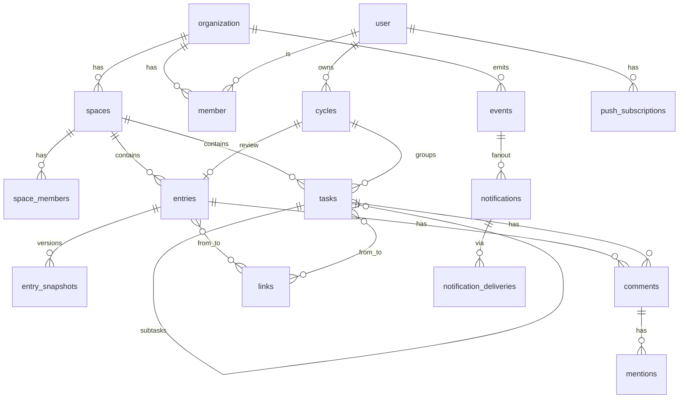

# 01 领域模型

> 状态：已采纳 · 版本：v2 · 更新：2026-09-25 · 最后对照代码：2026-09-25（+join_requests / calendars / calendar_events：`check-schema-drift` 零差异，24 表 / 236 列） · 依据 ADR-0001。本文是数据库 schema（`drizzle/`）与共享 Zod schema（`src/shared/`）的权威来源；两者与本文不一致时以本文为准并修代码。

---

## 1. 通用约定

| 项 | 约定 |
|---|---|
| 主键 | `uuid`，应用侧生成 **UUID v7**（时间有序，索引友好）；`uuid` 包 `v7()` |
| 时间 | 一律 `timestamptz`；`created_at`/`updated_at` 每表必有，`updated_at` 由应用层写 |
| 软删 | 用户可恢复的对象带 `deleted_at`；查询默认过滤；30 天后由 pg-boss 硬删（含附件文件） |
| 命名 | 表/列 `snake_case`，复数表名；Zod/TS `camelCase`，Drizzle 自动映射 |
| 枚举 | 用 PG `text` + Zod 枚举 + CHECK 约束，不用 PG `enum` 类型（加值要锁表） |
| 租户 | 一切业务表带 `workspace_id`（Better Auth `organization.id`）；一期只有一个 Workspace，但列一期就建 |
| 时间精度 | 业务表所有 `timestamptz` 列均为 `timestamptz(3)`（毫秒）。注（2026-09-24，迁移 0004）：JS Date 只有毫秒，微秒精度会让游标元组比较反复命中同一行、乐观锁 `ifUpdatedAt` 比较失真；下表类型列仍写 `timestamptz` |
| 排序 | 手动排序列 `sort_key text COLLATE "C"`，用 fractional indexing（`fractional-indexing` 包），拖拽只改一行。注（2026-09-24）：必须字节序排序规则，见 §3.1 |
| 并发 | 非富文本对象用 `updated_at` 作乐观锁：PATCH 带 `ifUpdatedAt`，不匹配 409 返回最新快照；富文本走 Yjs 无此问题 |
| 权限 | 见 §5；所有读写经 `can()`，schema 层不含权限逻辑 |

---

## 2. 认证域（Better Auth 托管）

由 Better Auth CLI 生成并迁移，**不手改**：`user`、`session`、`account`、`verification`、`organization`、`member`、`invitation`、`two_factor`、`passkey`、`api_key`。这些表由 Better Auth 生成，**不入 05 §6 的 schema 漂移检查**。

- Workspace ≡ `organization`；Workspace 角色 ≡ `member.role ∈ owner | admin | member | guest`。
- 应用扩展 `user` 的附加字段（Better Auth `additionalFields`）：`display_name`、`avatar_attachment_id`、`locale`（默认 `zh-CN`）、`timezone`（默认 `Asia/Shanghai`）、`week_starts_on`（默认 1）。
- ~~注册：`disableSignUp: true`，仅经 `invitation` 加入；~~`magicLink` 插件同样配置 `disableSignUp: true`（否则陌生邮箱会被自动建号）。
- 注（2026-09-25，ADR-0008）：加入途径 = **邀请**（`invitation`）或**自助注册 + 审批**（§3.14 `join_requests`）。Better Auth 的 `/sign-up/email` 仍关闭（`disableSignUp: true`），注册只走 `POST /workspace/join-requests`；注册后只有 `user`（无 `member` 行）→ 会话视为未登录，审批通过才写 `member`。`username` 插件给 `user` 增 `username`（唯一，存小写）与 `display_username`（原样）两列，可用用户名登录；密码下限 8 位。

---

## 3. 业务实体

表格格式是**机器契约**（05 §6 `check-schema-drift.ts` 逐行解析）：每张表固定三列「列 | 类型 | 说明」，一行一列，不合并单元格；类型用 PG 类型，可空在类型后加 `?`（如 `text?`），主键 / 外键写在说明列；索引、唯一约束、说明性文字放在表格下方的列表，不进表。

### 3.1 spaces —— 空间

| 列 | 类型 | 说明 |
|---|---|---|
| id | uuid | PK，UUID v7 |
| workspace_id | text | FK organization |
| name | text | |
| slug | text | 在 workspace 内唯一 |
| kind | text | `project` \| `learning` \| `work` |
| icon | text? | emoji 或 Lucide 名 |
| color | text? | 04 §2.1 的 8 色 token 名 |
| visibility | text | `workspace`（全员可见）\| `members`（仅 space_members） |
| is_personal | bool | 个人空间，默认 false；见下 |
| description | text? | |
| sort_key | text | fractional indexing；列级 `COLLATE "C"`（注 2026-09-24：键须按字节序比较，库默认 en_US.utf8 大小写不敏感会排错，迁移 0003） |
| archived_at | timestamptz? | 归档后空间只读：其任务与记录的写操作 403；列表默认隐藏（`?archived=1` 显示） |
| deleted_at | timestamptz? | 软删 |
| created_by | text | FK user |
| created_at | timestamptz | |
| updated_at | timestamptz | |

- 唯一：`(workspace_id, slug)`。
- **个人空间**（`is_personal=true`）：每个成员加入工作区时自动创建一个（`kind=work`、`visibility=members`、成员仅本人、名「个人」、slug `me-<userId ~~前~~ **末** 8 位>`；注（2026-09-23）：UUID v7 前 8 位是时间戳，同一分钟加入的成员会撞唯一约束，改取末 8 位随机段）；不可删除、不可加人、不可改可见性；是收件箱任务与个人记录（随笔、日志）的默认落点。每用户恰好一个：唯一 `(workspace_id, created_by) WHERE is_personal`。

**space_members**

| 列 | 类型 | 说明 |
|---|---|---|
| space_id | uuid | FK spaces，PK 之一 |
| user_id | text | FK user，PK 之一 |
| role | text | `admin` \| `member` \| `viewer` |
| joined_at | timestamptz | |

- PK `(space_id, user_id)`。`visibility=workspace` 时成员表仍用于「我的空间」排序与通知默认范围。

### 3.2 tasks —— 任务

| 列 | 类型 | 说明 |
|---|---|---|
| id | uuid | PK |
| workspace_id | text | FK organization |
| space_id | uuid | FK spaces，NOT NULL（收件箱任务落个人空间） |
| parent_id | uuid? | FK tasks；子任务，最多 2 层（应用层限制；父子须同空间，见 02 §9 注 2026-09-24） |
| title | text | |
| description_pm | jsonb? | 轻量富文本（ProseMirror JSON，不走 Yjs，见 03 §7） |
| description_plain | text? | 派生，用于搜索；由 tasks service 在写入 `description_pm` 的同一事务内生成（非 collab 路径） |
| status | text | `inbox` \| `todo` \| `doing` \| `blocked` \| `done` \| `cancelled` |
| priority | smallint | 0 无 · 1 低 · 2 中 · 3 高 · 4 紧急 |
| due_at | timestamptz? | 截止 |
| scheduled_at | timestamptz? | 计划开始 |
| completed_at | timestamptz? | status 进入 done 时写入，撤销时清空 |
| estimate_minutes | int? | |
| assignee_id | text? | FK user；成员被移除时置空并发 `task.unassigned` |
| creator_id | text | FK user |
| cycle_id | uuid? | FK cycles，归属周期 |
| recurrence | jsonb? | `{ freq: 'daily'\|'weekly'\|'monthly', interval: number, byWeekday?: number[], byMonthday?: number, until?: date }`；完成时由服务端生成下一个实例；`byMonthday` 大于当月天数时取当月最后一天，`interval` 以原始日期为基准不漂移；按用户时区的墙钟时间生成（跨 DST 允许 23/25 小时间隔） |
| sort_key | text | 看板列内排序；`COLLATE "C"`（同 §3.1） |
| tsv | tsvector? | 派生（title + description_plain），由 service 同事务写入 |
| deleted_at | timestamptz? | 软删 |
| created_at | timestamptz | |
| updated_at | timestamptz | 乐观锁 |

- 索引：`(space_id, status, sort_key)`、`(assignee_id, status, due_at)`、`(cycle_id)`、GIN `tsv`。

**task_watchers**

| 列 | 类型 | 说明 |
|---|---|---|
| task_id | uuid | FK tasks，PK 之一 |
| user_id | text | FK user，PK 之一 |
| created_at | timestamptz | |

- PK `(task_id, user_id)`；指派人、创建者自动加入。

### 3.3 cycles —— 周期（程）

| 列 | 类型 | 说明 |
|---|---|---|
| id | uuid | PK |
| workspace_id | text | FK organization |
| owner_id | text | FK user；周期属于人，不属于空间（一个人的周复盘横跨多个空间） |
| kind | text | `week` \| `month` \| `quarter` |
| start_date | date | week 用 ISO 周（周一起），month 自然月，quarter 自然季 |
| end_date | date | 同上 |
| title | text | 默认生成：`2026-W39` / `2026-09` / `2026-Q3` |
| goals | jsonb | `[{ id, text, done, taskIds[] }]` |
| review_entry_id | uuid? | FK entries（kind=review）；复盘正文走富文本 |
| status | text | `planning` \| `active` \| `reviewed`，单向流转 |
| created_at | timestamptz | |
| updated_at | timestamptz | |

- 唯一：`(owner_id, kind, start_date)`。

### 3.4 entries —— 记录（富文本主体）

| 列 | 类型 | 说明 |
|---|---|---|
| id | uuid | PK |
| workspace_id | text | FK organization |
| space_id | uuid | FK spaces，NOT NULL（个人记录落个人空间） |
| kind | text | `decision` \| `iteration` \| `bug` \| `changelog` \| `journal` \| `note` \| `review` |
| title | text | |
| fields | jsonb | 按 kind 的**元数据**（见 §3.5）；叙述性内容在正文，不在此重复 |
| visibility | text | `private`（仅作者）\| `space` \| `workspace` |
| author_id | text | FK user |
| ydoc | bytea | **唯一真源**：Yjs 文档 `Y.encodeStateAsUpdate` |
| ydoc_version | int | 每次落库 +1，用于快照与派生列一致性检查 |
| pm_json | jsonb? | 派生：ProseMirror JSON |
| plain | text? | 派生：纯文本 |
| tsv | tsvector? | 派生：`@node-rs/jieba` 分词后 `to_tsvector('simple', …)` |
| word_count | int? | 派生 |
| derived_at | timestamptz? | 派生列最后一次成功生成的时间；与 `ydoc_version` 配对判断是否过期 |
| derived_error | text? | 派生失败原因（03 §4.2）；非空时 `derive.retry` 作业重试，成功后清空 |
| embedding | vector(1024)? | 派生（二期）；维度随模型定，迁移时确定 |
| editor_schema_version | int | 编辑器 schema 版本（03 §3.3）；`onLoadDocument` 迁移后 bump；不放进 `fields` |
| pinned | bool | 默认 false |
| archived_at | timestamptz? | |
| deleted_at | timestamptz? | 软删 |
| created_at | timestamptz | |
| updated_at | timestamptz | 元数据乐观锁（正文不走它） |

- 索引：`(space_id, kind, updated_at desc)`、`(author_id, updated_at desc)`、GIN `tsv`、GIN `fields jsonb_path_ops`、（二期）HNSW `embedding`。
- `space_id` 不可空：无空间语义的记录一律落作者的个人空间（§3.1），可见性照常按 `visibility` 判定。

**entry_snapshots**

| 列 | 类型 | 说明 |
|---|---|---|
| id | uuid | PK |
| entry_id | uuid | FK entries |
| ydoc_version | int | 快照对应的版本 |
| snapshot | bytea | `Y.encodeSnapshot` |
| label | text? | 用户标记的版本名；非空者永久保留 |
| created_by | text? | FK user；自动快照为空 |
| created_at | timestamptz | |

- 索引：`(entry_id, created_at desc)`。保留策略见 03 §5。

### 3.5 `fields` 按 kind 的 Zod schema（`src/shared/entryFields.ts`）

```ts
decision : { status: 'proposed'|'accepted'|'superseded'|'rejected', supersedesId?: uuid, decidedAt?: date }
bug      : { severity: 'low'|'medium'|'high'|'critical', status: 'open'|'fixed'|'wontfix', commit?: string, debugDir?: string }
iteration: { periodStart: date, periodEnd: date, version?: string }
changelog: { version: string, releasedAt: date }
review   : { cycleId: uuid }
journal  : { mood?: 1|2|3|4|5 }
note     : {}
```
叙述结构（背景/选项/决定/后果 等）由**正文模板**承载（03 §6），不进 `fields`。

### 3.6 links —— 链接（双向）

| 列 | 类型 | 说明 |
|---|---|---|
| id | uuid | PK |
| workspace_id | text | FK organization |
| from_type | text | `entry` \| `task` \| `cycle` |
| from_id | uuid | 源对象 |
| to_type | text | `entry` \| `task` \| `cycle` \| `external` |
| to_id | uuid? | 目标对象；`to_type=external` 时为空 |
| external_url | text? | 简斋文档、GitHub commit 等；一期只存 URL 不抓取（07 §2.5） |
| external_title | text? | 用户填写 |
| kind | text | `relates` \| `blocks` \| `caused_by` \| `resolves` \| `mentions` |
| created_by | text | FK user |
| created_at | timestamptz | |

- 唯一：`(from_type, from_id, to_type, to_id, kind)`（`to_id` 为空时以 `external_url` 参与唯一）。
- 编辑器内的 `entryLink` 节点在落库钩子里同步为 `kind=mentions` 的行（删则删），反链面板只查此表。

### 3.7 tags —— 标签

| 列 | 类型 | 说明 |
|---|---|---|
| id | uuid | PK |
| workspace_id | text | FK organization |
| name | text | |
| color | text | 04 §2.1 的 8 色 token 名 |
| created_at | timestamptz | |

- 唯一：`(workspace_id, name)`。

**task_tags**

| 列 | 类型 | 说明 |
|---|---|---|
| task_id | uuid | FK tasks，PK 之一 |
| tag_id | uuid | FK tags，PK 之一 |

**entry_tags**

| 列 | 类型 | 说明 |
|---|---|---|
| entry_id | uuid | FK entries，PK 之一 |
| tag_id | uuid | FK tags，PK 之一 |

### 3.8 attachments —— 附件

| 列 | 类型 | 说明 |
|---|---|---|
| id | uuid | PK |
| workspace_id | text | FK organization |
| owner_id | text | FK user，上传者 |
| target_type | text? | `entry` \| `task` \| `comment` \| `user`（头像） |
| target_id | uuid? | 与 `target_type` 同时为空或同时非空 |
| filename | text | 原始文件名，只用于 `Content-Disposition`（RFC 5987 编码），不参与路径 |
| mime | text | 按魔数判定（07 §2.4） |
| size | int | 字节 |
| sha256 | text | 去重键，范围为同 workspace + 同 owner |
| storage_key | text | `data/uploads/<workspace>/<yyyy>/<mm>/<uuid>.<ext>`，服务端生成 |
| width | int? | 图片派生（sharp） |
| height | int? | 图片派生 |
| blurhash | text? | 图片派生 |
| variants | jsonb? | `{ thumb, md }` 缩图 storage_key |
| created_at | timestamptz | |

- 索引：`(target_type, target_id)`、唯一 `(workspace_id, owner_id, sha256)`。
- **归属在上传时确定**：编辑器与评论上传一律带 `targetType/targetId`（03 §11.4）；无归属的附件只来自上传后未插入正文的情况，7 天后清理（07 §3）。无 target 的附件只有 `owner_id` 本人可读（§5）。

### 3.9 comments / mentions

**comments**

| 列 | 类型 | 说明 |
|---|---|---|
| id | uuid | PK |
| workspace_id | text | FK organization |
| target_type | text | `entry` \| `task` |
| target_id | uuid | 目标对象 |
| thread_id | uuid | 编辑器内锚定评论的 `comment` mark 存的就是它；任务评论 thread_id = 线程首条评论的 id |
| parent_id | uuid? | FK comments，回复 |
| author_id | text | FK user |
| body_pm | jsonb | liteKit 子集（03 §7） |
| body_plain | text | 派生，由 service 同事务写入 |
| orphaned | bool | 默认 false；编辑器内锚定文本被删除后置 true，线程保留并在侧栏显示（03 §3.2）。注 2026-09-24：「锚定线程」= 根评论 `thread_id ≠ id`（编辑器创建时自带 threadId）；由记录派生（`writeEntryDerived` → `syncCommentAnchors`）按正文 comment 标记同步，标记恢复时复位；非锚定线程不动 |
| resolved_at | timestamptz? | |
| resolved_by | text? | FK user |
| deleted_at | timestamptz? | 软删；有回复时显示「已删除」占位 |
| created_at | timestamptz | |
| updated_at | timestamptz | |

- 索引：`(target_type, target_id, created_at)`、`(thread_id)`。

**mentions**

| 列 | 类型 | 说明 |
|---|---|---|
| id | uuid | PK |
| comment_id | uuid? | FK comments；评论内提及 |
| entry_id | uuid? | FK entries；正文内提及（collab 落库时从 pm_json 抽取） |
| user_id | text | FK user，被提及者 |
| created_at | timestamptz | |

- `comment_id` 与 `entry_id` 恰好一个非空；写入即触发 `mention.created` 事件。

### 3.10 events —— 领域事件（出箱 + 活动流）

| 列 | 类型 | 说明 |
|---|---|---|
| id | uuid | PK，UUID v7（时间有序，活动流按此分页） |
| workspace_id | text | FK organization |
| kind | text | 见 §4 |
| actor_id | text? | FK user；系统事件为空 |
| target_type | text | `task` \| `entry` \| `cycle` \| `space` \| `comment` \| `member` \| `job` \| `system` \| `calendar_event`（注 2026-09-25，ADR-0009） |
| target_id | uuid? | 目标对象；`system` 为空 |
| payload | jsonb | 标题、摘要、变更前后值等，**自包含**，渲染通知不回查（§4.1） |
| visibility_scope | jsonb | `{ spaceId?, userIds?[] }` 供活动流过滤 |
| created_at | timestamptz | |
| processed_at | timestamptz? | 出箱消费完成时间；为空表示待接力 |

- 索引：`(processed_at) WHERE processed_at IS NULL`、`(workspace_id, created_at desc)`。
- 事件与业务写入**同一事务**。活动流 = 按 `can()` 过滤后的 events。

**接力（outbox → pg-boss）**：不是 cron（pg-boss `schedule()` 最小粒度 1 分钟）。`outbox.drain` 是**自循环作业**：worker 启动时 `send('outbox.drain', {}, { singletonKey: 'outbox.drain' })`；每次执行批量取 `processed_at IS NULL` 的行（`FOR UPDATE SKIP LOCKED`，每批 200），逐条入队 `notify.fanout`（`singletonKey = event.id`，保证同一事件只有一个 fanout 作业）后标 `processed_at`，末尾再次 `send` 自身并带 `startAfter: 5`（秒）；批满 200 则立即续跑不等待。业务写入事务提交后可 best-effort 再 `send('outbox.drain')`（同 `singletonKey`，已在队列时被合并）。注（2026-09-24，实现）：以触发器代替逐处调用——`events` 插入的语句级触发器 `pg_notify('xz_outbox')`，通知只在提交后投递，worker `LISTEN xz_outbox` 后立即 drain（`drizzle/0002_outbox_notify.sql`），事件 → 通知实测 < 2s；邮件由独立作业 `notify.email` 发送，不阻塞扇出。不在事务内直接调 pg-boss。`processed_at` 只在入队成功后写，入队失败下一轮重取；fanout 的幂等由 `notifications` 唯一索引保证（§3.11）。有事件 `created_at` 早于 1 小时仍 `processed_at IS NULL` 时，发 `system.outbox_stalled` 给所有 admin（§4）。

### 3.11 notifications 域

**notifications**

| 列 | 类型 | 说明 |
|---|---|---|
| id | uuid | PK |
| user_id | text | FK user，接收者 |
| event_id | uuid | FK events |
| kind | text | 冗余自 event，便于筛选 |
| title | text | 渲染后的标题（§4.1 模板） |
| body | text? | |
| url | text | 深链，不带 token |
| read_at | timestamptz? | |
| archived_at | timestamptz? | |
| meta | jsonb? | `{ mergedEventIds?: uuid[], count?: number }`，合并策略用 |
| created_at | timestamptz | 合并时更新为最新 |

- 索引：`(user_id, read_at)`、`(user_id, created_at desc)`。
- **唯一 `(user_id, event_id)`**：fanout 用 `INSERT … ON CONFLICT DO NOTHING`，pg-boss 重试不会重复发通知。

**notification_deliveries**

| 列 | 类型 | 说明 |
|---|---|---|
| id | uuid | PK |
| notification_id | uuid | FK notifications |
| channel | text | `in_app` \| `webpush` \| `email`；**SSE 不落投递行**（进程内推送，失败无意义重试） |
| status | text | `pending` \| `sent` \| `failed` \| `skipped` |
| sent_at | timestamptz? | |
| error | text? | |
| created_at | timestamptz | |

- 索引：`(notification_id)`；保留 30 天（07 §3）。

**notification_preferences**

| 列 | 类型 | 说明 |
|---|---|---|
| user_id | text | FK user，PK 之一 |
| event_kind | text | PK 之一 |
| channels | text[] | 子集 `in_app` \| `sse` \| `webpush` \| `email` |
| digest | text | `instant` \| `daily` |
| updated_at | timestamptz | |

- PK `(user_id, event_kind)`；缺行时用默认表（§4）。

**push_subscriptions**

| 列 | 类型 | 说明 |
|---|---|---|
| id | uuid | PK |
| user_id | text | FK user |
| endpoint | text | 唯一 |
| keys | jsonb | `{ p256dh, auth }` |
| user_agent | text? | |
| created_at | timestamptz | |
| last_used_at | timestamptz? | |

- 唯一 `(endpoint)`；端点返回 410 即删。

### 3.12 audit_log —— 审计日志

| 列 | 类型 | 说明 |
|---|---|---|
| id | uuid | PK |
| workspace_id | text? | FK organization；登录类事件可为空 |
| actor_id | text? | FK user；系统作业为空 |
| action | text | 见下方枚举 |
| target_type | text? | |
| target_id | text? | user id 为 text，其余 uuid 以 text 存 |
| ip | text? | |
| user_agent | text? | |
| meta | jsonb? | 变更前后值、错误摘要等；不含密码、token、正文 |
| created_at | timestamptz | |

- 索引：`(workspace_id, created_at desc)`、`(actor_id, created_at desc)`、`(action)`。
- 只增不改，无软删，无 UPDATE/DELETE 端点。
- `action` 枚举（Zod `AuditAction`，新增值先改本表）：
  注（2026-09-25，ADR-0008）：+ `member.registered`（自助注册，actor 为空）· `member.approved` · `member.rejected`（驳回即删号，`meta` 留邮箱 / 用户名）。
  `auth.login` · `auth.logout` · `auth.login_failed` · `auth.locked` · `auth.password_reset` · `auth.2fa_enabled` · `auth.2fa_disabled` · `auth.2fa_reset_by_admin` · `member.invited` · `member.joined` · `member.registered` · `member.approved` · `member.rejected` · `member.role_changed` · `member.suspended` · `member.unsuspended` · `member.removed` · `member.content_transferred` · `user.deleted` · `workspace.owner_transferred` · `workspace.settings_changed` · `space.deleted` · `space.permanently_deleted` · `task.permanently_deleted` · `entry.permanently_deleted` · `export.requested` · `export.done` · `export.failed` · `api_key.created` · `api_key.revoked` · `gc.failed` · `backup.failed`

### 3.13 idempotency_keys

| 列 | 类型 | 说明 |
|---|---|---|
| key | uuid | PK，请求头 `Idempotency-Key` |
| user_id | text | FK user；不同用户同 key 视为不同（主键只有 key，实现为他人 key 不回放、不记录，02 §5 注） |
| response_status | smallint | `0` = 处理中占位（注 2026-09-24，02 §5） |
| response_body | jsonb | 原样回放 |
| created_at | timestamptz | 24h 后由 pg-boss 清理 |

- 用途见 02 §5。

### 3.14 join_requests —— 注册申请（ADR-0008）

| 列 | 类型 | 说明 |
|---|---|---|
| id | uuid | PK |
| workspace_id | text | FK organization |
| user_id | text | FK user，级联删除；唯一 |
| status | text | `pending` \| `approved`（驳回即删 user，不留 rejected 行） |
| ip | text? | 注册来源 IP（审计 / 防刷） |
| decided_by | text? | FK user；审批人 |
| decided_at | timestamptz? | |
| created_at | timestamptz | |

- 索引：`(status, created_at)`；唯一 `(user_id)`。
- 待审批总量上限 200（07 §5），超出注册返回 429。

### 3.15 calendars / calendar_events —— 日历与日程（ADR-0009）

**calendars**

| 列 | 类型 | 说明 |
|---|---|---|
| id | uuid | PK |
| workspace_id | text | FK organization |
| owner_id | text | FK user，级联删除；**个人私有**，仅本人可读写（§5） |
| name | text | ≤ 40 字 |
| color | text | 04 §2.1 的 8 色 token 名 |
| hidden | bool | 在日历页是否显示（macOS 勾选框） |
| is_default | bool | 新建日程的默认日历；每人恰一个 |
| position | int | 列表顺序 |
| created_at | timestamptz | |
| updated_at | timestamptz | |

- 首次读取自动建 4 个：个人（moss，默认）· 工作（indigo）· 学习（amber）· 生活（plum）；每人上限 30；至少保留 1 个。删除日历级联删除其日程。

**calendar_events**

| 列 | 类型 | 说明 |
|---|---|---|
| id | uuid | PK |
| workspace_id | text | FK organization |
| calendar_id | uuid | FK calendars，级联删除 |
| owner_id | text | FK user，级联删除 |
| title | text | ≤ 200 字 |
| location | text? | |
| notes | text? | ≤ 5000 字，纯文本 |
| url | text? | |
| all_day | bool | 全天事件 |
| start_at | timestamptz | 定时：开始时刻；全天：`timezone` 下开始日 00:00 |
| end_at | timestamptz | 独占；全天：结束日次日 00:00；CHECK `end_at > start_at` |
| timezone | text | IANA；重复展开与全天日期都按它计算 |
| rrule | text? | RFC 5545 RRULE（不含 DTSTART），FREQ ∈ DAILY/WEEKLY/MONTHLY/YEARLY；null = 不重复 |
| repeat_until | timestamptz? | 由 RRULE 的 UNTIL / COUNT 推得的系列结束；null = 无限（区间查询剪枝） |
| exdates | timestamptz[] | 被排除的发生时刻（删 / 改单次） |
| recurrence_id | uuid? | 单次改写行 → 母事件 id |
| original_start_at | timestamptz? | 单次改写对应的原发生时刻；与 `recurrence_id` 同空同非空（CHECK） |
| alarms | int[] | 提醒：开始前分钟数（≤ 5 个，-1440 ~ 10080；全天相对当天 00:00，负数 = 当天之后，如 -540 = 09:00） |
| deleted_at | timestamptz? | 软删（整系列删除同时软删其改写行） |
| created_at | timestamptz | |
| updated_at | timestamptz | 乐观锁 `ifUpdatedAt` |

- 索引：`(owner_id, start_at, end_at)`、`(recurrence_id)`、部分索引 `(start_at) WHERE cardinality(alarms) > 0 AND deleted_at IS NULL`（提醒作业）。
- 重复展开在服务端按 `timezone` 的**本地墙钟**进行（跨 DST 仍是「每天 09:00」），单次查询最多展开 2000 次发生；`GET /calendar-events?from&to` 返回的是「发生」（occurrence），不是行。
- 改 / 删范围（macOS 语义）：`this` = 母事件加 exdate + 插改写行（删则只加 exdate）；`future` = 母事件 RRULE 截断到该次之前（UNTIL），从该次起另起新系列（去 COUNT）；`all` = 改母事件（从某次拖动时按偏移平移整个系列，时间 / 规则变化时清空改写行与 exdates）。
- 与任务的关系：任务不进本表；日历页把任务（`dueAt` / `scheduledAt`）作为叠加层只读显示（REQ-UI-031）。

### 3.16 二期预留

`git_repos(id, space_id, path, remote_url, last_scanned_sha, scanned_at)`；`import_jobs`。不在一期建表。

---

## 4. 事件种类与默认通知

| kind | 触发 | 默认接收者 | 默认通道 |
|---|---|---|---|
| entry.updated | collab 落库（03 §4.2，5 分钟合并） | 无（仅活动流） | — |
| task.assigned | 指派变更 | 新指派人 | in_app, sse, webpush |
| task.unassigned | 成员移除 / 停用导致指派置空（07 §4） | 该任务所在空间的 space admin（无则工作区 admin） | in_app, sse |
| task.due_soon | 截止前 24h（pg-boss cron） | 指派人 | in_app, sse, webpush, email |
| task.completed | 完成 | watchers（除操作者） | in_app, sse |
| task.uncompleted | 撤销完成（8s 撤销线或手动回退） | 无（仅活动流） | — |
| task.commented / entry.commented | 新评论 | 目标作者 + 线程参与者（task 另加 watchers，注 2026-09-24：按 REQ-TASK-014「watcher 收到完成与评论通知」补齐） | in_app, sse, webpush |
| mention.created | @提及 | 被提及者 | in_app, sse, webpush, email |
| space.invited | 加入空间 | 被邀者 | in_app, email |
| member.joined | 受邀者接受邀请成为成员；注册申请被批准（注 2026-09-25，`inviter*` = 审批人） | 所有 admin（除邀请人本人） | in_app |
| member.requested | 自助注册提交（ADR-0008） | 所有 owner / admin | in_app, sse, email |
| workspace.owner_transferred | owner 转让 | 原 owner 与新 owner | in_app, email |
| cycle.review_due | 周期结束当天 | owner | in_app, webpush, email |
| calendar.reminder | 日程提醒时刻（开始 − 提前量；pg-boss 每分钟扫描，ADR-0009） | 日程 owner | in_app, sse, webpush |
| system.export_done / system.backup_failed | 系统 | 发起人 / 所有 admin | in_app, email（export_done 另加 sse，注 2026-09-24：前端据此弹状态 Toast，REQ-UI-008） |
| system.outbox_stalled | 有事件超过 1 小时未接力（§3.10） | 所有 admin | in_app, email |

### 4.1 事件 payload 与通知模板

payload **自包含**：渲染通知、活动流、邮件时不回查业务表（对象已被删或改名也能渲染）。`summary` ≤ 120 字（正文取 `plain` 前 120 字，任务取 `description_plain`）。深链是前端路由，**不带任何 token**；收件人点开后仍经会话与 `can()` 判定。

| kind | payload（TS 片段） | 标题模板（i18n key → zh-CN） | 正文模板 | 深链 `url` | 合并策略（5 分钟窗） |
|---|---|---|---|---|---|
| entry.updated | `{ entryId, title, kind, actorId, actorName, spaceSlug, ydocVersion, wordCount, summary }` | —（仅活动流；活动流文案 key `notif.activity.entry.updated` → 「{actor} 更新了记录 {title}」） | `{summary}` | `/entries/:entryId` | collab 侧：同 entry 同 actor 5 分钟内已有 `processed_at IS NULL` 的行则 UPDATE 其 payload，不新增（不进 notifications） |
| task.assigned | `{ taskId, title, actorId, actorName, assigneeId, prevAssigneeId?, spaceSlug, dueAt? }` | `notif.task.assigned` → 「{actor} 把任务 {title} 指派给你」 | 「截止 {dueAt}」或「无截止」 | `/spaces/:spaceSlug/tasks/:taskId` | 同 task 再次改派时覆盖为最新指派 |
| task.unassigned | `{ taskId, title, prevAssigneeId, prevAssigneeName, reason: 'member_removed' \| 'member_suspended', spaceSlug, dueAt? }` | `notif.task.unassigned` → 「任务 {title} 的负责人已离开」 | 「原负责人 {prevAssigneeName}，请重新指派」 | `/spaces/:spaceSlug/tasks/:taskId` | 同一成员离开导致的多条 → 「{prevAssigneeName} 离开，{n} 个任务待重新指派」，`url` 改为 `/spaces/:spaceSlug?view=list&assignee=none` |
| task.due_soon | `{ taskId, title, assigneeId, spaceSlug, dueAt, hoursLeft }` | `notif.task.due_soon` → 「任务 {title} 将在 {hoursLeft} 小时后截止」 | 「截止 {dueAt}」 | `/spaces/:spaceSlug/tasks/:taskId` | 每个（任务，截止时刻）只发一条；改期后重新计算（注 2026-09-24：原文「每 24h 最多一条」与「改期后重算」在 24h 内连续改期时冲突，以后者为准；作业 `task.due-soon` 每 15 分钟） |
| task.completed | `{ taskId, title, actorId, actorName, spaceSlug, completedAt, prevStatus?, cycleId? }`（注 2026-09-24：`prevStatus` 供 uncomplete 回退） | `notif.task.completed` → 「{actor} 完成了任务 {title}」 | `{summary}` | `/spaces/:spaceSlug/tasks/:taskId` | 同 actor 5 分钟内多条 → 「{actor} 完成了 {n} 个任务」，`url` 改为 `/spaces/:spaceSlug?view=list&status=done`；5 分钟内收到同 task 的 `task.uncompleted` → 原通知标题改「{actor} 撤销了完成」，不新发 |
| task.uncompleted | `{ taskId, title, actorId, actorName, spaceSlug, prevStatus }` | —（不进 notifications；活动流 key `notif.activity.task.uncompleted`） | — | — | 仅活动流；触发上一行的原地更新 |
| task.commented | `{ taskId, title, commentId, threadId, actorId, actorName, spaceSlug, summary }` | `notif.task.commented` → 「{actor} 评论了任务 {title}」 | `{summary}` | `/spaces/:spaceSlug/tasks/:taskId#c-:commentId` | 同 thread → 「{actor} 等 {m} 人发表了 {n} 条评论」，`url` 指向最新评论 |
| entry.commented | `{ entryId, title, commentId, threadId, actorId, actorName, summary }` | `notif.entry.commented` → 「{actor} 评论了记录 {title}」 | `{summary}` | `/entries/:entryId#c-:commentId` | 同上 |
| mention.created | `{ targetType: 'entry' \| 'comment', targetId, title, commentId?, actorId, actorName, summary, url }` | `notif.mention.created` → 「{actor} 在 {title} 中提到了你」 | `{summary}`（含 @ 的那一句） | 记录：`/entries/:entryId#m-:mentionId`；评论：同 task/entry.commented | 不合并（每次提及单独一条） |
| space.invited | `{ spaceId, spaceName, spaceSlug, actorId, actorName, role }` | `notif.space.invited` → 「{actor} 邀请你加入空间 {title}」 | 「你的角色：{role}」 | `/spaces/:spaceSlug` | 不合并 |
| member.joined | `{ userId, displayName, email, role, inviterId, inviterName }` | `notif.member.joined` → 「{displayName} 已加入工作区」 | 「角色 {role}，由 {inviterName} 邀请」 | `/settings/workspace/members` | 5 分钟内多人 → 「{n} 位新成员已加入」 |
| member.requested | `{ requestId, userId, displayName, username, email }` | 「{displayName}（@{username}）申请加入工作区」 | `{email}` | `/settings/workspace/members?tab=requests` | 5 分钟内多条 → 「{n} 个注册申请待审批」 |
| calendar.reminder | `{ eventId, ownerId, title, location?, allDay, occurrenceStart, alarm, date }` | 定时：「{HH:mm} {title}」；全天：「今天：{title}」 | 「地点：{location}」或空 | `/calendar?view=day&date={date}` | 不合并；每（日程, 发生时刻, 提前量）只发一次，错过 5 分钟窗口不补发 |
| workspace.owner_transferred | `{ fromUserId, fromName, toUserId, toName }` | `notif.workspace.owner_transferred` → 「工作区所有权已从 {fromName} 转给 {toName}」 | 「原 owner 降为 admin」 | `/settings/workspace` | 不合并 |
| cycle.review_due | `{ cycleId, kind, title, ownerId, startDate, endDate, doneCount, totalCount }` | `notif.cycle.review_due` → 「{title} 已结束，停在枝头回望一下吧」 | 「本周期完成 {doneCount}/{totalCount} 个任务」 | `/cycles/:cycleId` | 同 cycle 只一条 |
| system.export_done | `{ jobId, scope, format, fileName, sizeBytes, expiresAt }` | `notif.system.export_done` → 「导出已完成：{fileName}」 | 「{sizeBytes} · {expiresAt} 前可下载」 | `/jobs/:jobId` | 不合并 |
| system.backup_failed | `{ jobId, backupDate, errorCode, errorSummary }` | `notif.system.backup_failed` → 「{backupDate} 备份失败」 | `{errorSummary}` | `/settings/workspace/audit?job=:jobId` | 同日只一条，后续失败更新 `errorSummary` |
| system.outbox_stalled | `{ oldestEventId, oldestCreatedAt, pendingCount }` | `notif.system.outbox_stalled` → 「通知队列积压：{pendingCount} 条超过 1 小时未处理」 | 「最早事件 {oldestCreatedAt}」 | `/settings/workspace/audit` | 同日只一条，后续更新 `pendingCount` |

- payload 的 Zod schema 放 `src/shared/schemas/events.ts`，以 `kind` 为判别键的联合类型；`emit()` 入参与 worker 出参同一 schema，不符即在事务内抛错。
- 邮件模板 `src/server/mail/templates/<kind>.tsx`（react-email），标题复用上表 i18n key，正文含深链按钮与「管理通知偏好」链接；HTML 与纯文本两版。
- 工作区级邀请（`POST /workspace/invitations`）的邮件由 Better Auth `organization.sendInvitationEmail` 钩子发送，复用同一模板模块 `templates/workspace-invitation.tsx`；**不进 `events`**（受邀者尚不是用户，无扇出对象）。`space.invited` 只用于已是成员的用户被加入空间；受邀者接受后由 service 发 `member.joined`。
- 每日摘要（`digest=daily`）：一封邮件，按空间分组（个人空间的归「个人」），每组最多 10 条、超出显示「还有 {n} 条 · 查看全部」链接到 `/notifications?unread=1`；组内按 kind 再合并（同上表策略）；当日无内容不发。

规则：
- 操作者不收自己触发的通知。
- **扇出前对每个接收者做 `can(user, '<target>.read', target)`**，无权者跳过（例：正文 @ 了没有 entry.read 的人，不发通知、不泄露标题）。
- 幂等：`notifications` 唯一 `(user_id, event_id)` + `ON CONFLICT DO NOTHING`；pg-boss 重试 fanout 不会重复通知。
- 合并：`notify.fanout` 处理时查同一 `(user_id, target, kind)` 5 分钟内已有未读 notification 则更新其 `title/body/url/created_at`，不插入新行（唯一索引因此不冲突；被合并事件的 `event_id` 追加到旧行 `meta.mergedEventIds`，供活动流去重）。
- `entry.updated` 的 5 分钟窗口在 collab 侧（03 §4.2）：`onStoreDocument` 事务内查同 entry 同 actor、`processed_at IS NULL`、`created_at` 在 5 分钟内的行，存在则 UPDATE 其 `payload`（`ydocVersion / wordCount / summary`）与 `created_at`，不新增。
- `digest=daily` 的通道由每日 08:00（用户时区）cron 汇总一封。

---

## 5. 权限矩阵（`src/server/authz.ts` 的规格）

Workspace 角色 × Space 角色 → 有效角色取**较高者**，`guest` 只能拿到显式加入的 Space 的 `viewer`。

| 动作 | owner/admin | member | guest(viewer) |
|---|---|---|---|
| workspace.manage（成员、设置、审计） | ✓ | ✗ | ✗ |
| member.suspend / member.unsuspend | ✓ | ✗ | ✗ |
| member.revoke_sessions | ✓ | ✗ | ✗ |
| member.transfer_content（批量转移作者） | ✓ | ✗ | ✗ |
| workspace.owner_transfer | 仅 owner | ✗ | ✗ |
| me.delete（注销，07 §4 匿名化） | 本人（owner 须先转让） | 本人 | 本人 |
| space.create | ✓ | ✓ | ✗ |
| space.manage（改名、成员、归档） | ✓ | space admin | ✗ |
| space.delete（软删、永久删） | ✓ | ✗ | ✗ |
| task.read | ✓ | space 成员 或 visibility=workspace | 已加入 space |
| task.write | ✓ | space member+ | ✗ |
| entry.read | 见下 | 见下 | 见下 |
| entry.write | ✓ | 作者，或 space admin | ✗ |
| entry.delete | ✓ | 作者 | ✗ |
| comment.create | ✓ | 可 read 即可 | 可 read 即可 |
| comment.resolve | ✓ | 目标作者 / 评论作者 | ✗ |
| attachment.read | 跟随其 target 的 read；**无 target 的附件仅 `owner_id` 本人** | 同左 | 同左 |
| cycle.* | 仅 owner_id 本人（admin 可 read） | | |
| calendar.read / calendar.write（日历与日程，ADR-0009） | 仅 owner_id 本人（admin 也不可见） | 仅本人 | 仅本人 |
| member.approve（审批注册申请，ADR-0008） | ✓ | ✗ | ✗ |
| notification.* | 仅本人 | | |

`entry.read`：`private` 仅作者；`space` 需 space.read；`workspace` 需 workspace 成员。**软删对象对所有人不可读**（作者可在回收站看到）。最后一名 owner 不可降级、移除、注销（409 `CONFLICT_LAST_OWNER`）；成员生命周期各转换的影响见 07 §4。

**权限变更的广播**（供 collab / SSE 即时收回访问，不做定时复核）：以下写操作在事务提交后经进程内 `EventBus` 广播，collab 对受影响连接重新执行 `can()`，失败则断开（03 §4.2）：
- `user.revoked(userId)`：成员移除、停用、改密、吊销会话、注销 → 断开该用户全部 WS 与 SSE。
- `entry.access_changed({ entryIds?, spaceId?, userIds? })`：`entries.visibility / space_id` 变更、`space_members` 增删改、空间归档 / 软删、成员角色变更 → 只复核涉及的文档与用户。

不变量：
1. `can()` 是唯一判定入口；API 中间件、Hocuspocus 钩子、SSE 订阅、附件下载、MCP 工具全部调用它，业务代码禁止直接比较角色。
2. `can()` 输入只依赖 `(user, workspaceRole, spaceRole, resource 元数据)`，纯函数，可脱离 DB 单测；角色矩阵测试覆盖全部 动作 × 角色 组合。
3. 列表查询用 `visibleEntriesWhere(user)` / `visibleTasksWhere(user)`（日程：`visibleCalendarsWhere` / `visibleCalendarEventsWhere`）生成 Drizzle 条件，与 `can()` 共享同一份规则表，避免「能列出但不能读」或反之。

---

## 6. 实体关系图



---

## 7. 迁移策略

- `drizzle-kit generate` 产出 SQL 迁移入库，`drizzle-kit migrate` 在容器启动时执行（app 启动前的 init 步骤）。
- Better Auth 表由其 CLI 生成迁移，与业务迁移同一目录、同一序号流。
- 派生列可随时用 `pnpm xz rebuild-derived [--entries|--tasks|--comments]` 全量重建：entries 从 `ydoc`，tasks / comments 从 `description_pm` / `body_pm`；**任何派生列的 bug 都不需要数据迁移，只需重建**。
- 破坏性变更（删列、改枚举）必须两步：先加新写双写，下一版本再删。
