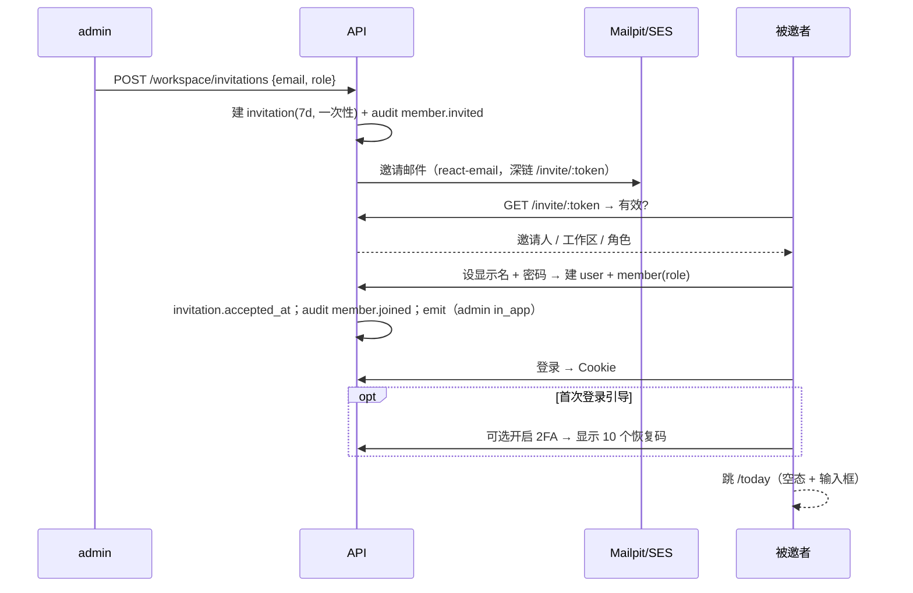

# 08 页面与流程

> 状态：已采纳 · 版本：v2 · 更新：2026-09-25 · 最后对照代码：2026-09-25（ADR-0010：§2.13 用户管理 / 个人资料、§2.17 拖选新建；`/register`、§2.17 日历改版、今日速览栏） · 依据 00（REQ）、01 §4.1（深链）、02 §9（端点）、04 §4–§6、06 §4、07 §4–§5。
> 本文回答「每个页面显示什么、URL 长什么样、三态是什么、关键流程怎么走、边界情况怎么办、离线能做什么、哪些浏览器算支持」。路由是 TanStack Router 文件式；search params 一律有 Zod schema，URL 可分享即 URL 是状态。

---

## 1. 路由表

| 路由 | 文件 | 页面 | 可进入角色 | Phase | 主 REQ |
|---|---|---|---|---|---|
| `/login` | `routes/login.tsx` | 登录（邮箱密码 / Passkey / 魔法链接） | anon | 0 | REQ-AUTH-001 · 007 · 008 |
| `/invite/$token` | `routes/invite.$token.tsx` | 接受邀请、设密码 | anon | 0 | REQ-AUTH-003 · 004 |
| `/register` | `routes/register.tsx` | 申请注册（待审批，ADR-0008） | anon | 2 | REQ-AUTH-017 |
| `/login/2fa` | `routes/login_.2fa.tsx`（注：TanStack 扁平命名下 `login.2fa.tsx` 会嵌套进 `/login`，须用 `login_` 前缀） | TOTP / 恢复码 | 半登录态 | 0 | REQ-AUTH-006 |
| `/` | `routes/index.tsx` | 重定向 → `/today` | 已登录 | 0 | — |
| `/today` | `routes/today.tsx` | 今日 | guest+ | 1 | REQ-TASK-005 · 017 |
| `/inbox` | `routes/inbox.tsx` | 收件箱 | guest+ | 1 | REQ-TASK-006 |
| `/spaces` | `routes/spaces.index.tsx` | 空间列表（含归档折叠） | guest+ | 1 | REQ-SPACE-001 · 004 · 005 |
| `/spaces/$spaceSlug` | `routes/spaces.$spaceSlug.tsx` | 空间任务（看板 / 列表，`?view=`） | 空间可读 | 1 | REQ-TASK-003 · 004 · 020 |
| `/spaces/$spaceSlug/tasks/$taskId` | `routes/spaces.$spaceSlug.tasks.$taskId.tsx` | 任务详情 Sheet（叠在上一路由之上） | 空间可读 | 1 | REQ-TASK-012 · REQ-UI-022 |
| `/spaces/$spaceSlug/entries` | `routes/spaces.$spaceSlug.entries.tsx` | 空间记录列表 | 空间可读 | 1 | REQ-ENTRY-002 · 006 |
| `/entries` | `routes/entries.index.tsx` | 全部记录（跨空间 + 个人） | guest+ | 1 | REQ-ENTRY-002 · 003 |
| `/entries/$entryId` | `routes/entries.$entryId.tsx` | 记录编辑（Tiptap + Yjs） | `entry.read` | 0 | REQ-COLLAB-001 · 004 · REQ-EDITOR-001 |
| `/entries/$entryId/history` | `routes/entries.$entryId.history.tsx` | 可分享短链：重定向到 `/entries/$entryId?aside=history` | `entry.read` | 2 | REQ-COLLAB-008 |
| `/cycles` | `routes/cycles.index.tsx` | 周期列表（`?kind=&year=`） | member+ | 2 | REQ-CYCLE-001 · 002 |
| `/cycles/$cycleId` | `routes/cycles.$cycleId.tsx` | 周期详情（目标、任务、复盘） | owner 本人 / admin 读 | 2 | REQ-CYCLE-003 · 006 · 007 |
| `/calendar` | `routes/_app.calendar.tsx` | 日历（日程 + 任务叠加；日 / 周 / 月 / 年视图，ADR-0009） | guest+ | 2 | REQ-CAL-001 ~ 009 · REQ-TASK-024 · REQ-UI-031 |
| `/search` | `routes/search.tsx` | 搜索结果页（⌘K 的落地页） | guest+ | 1 | REQ-SEARCH-001 · 004 |
| `/notifications` | `routes/notifications.tsx` | 通知中心 | guest+ | 1 | REQ-NOTIF-005 |
| `/settings` | `routes/settings.index.tsx` | 个人资料 | guest+ | 1 | REQ-WS-010 |
| `/settings/notifications` | `routes/settings.notifications.tsx` | 通知偏好 | guest+ | 1 | REQ-NOTIF-006 |
| `/settings/security` | `routes/settings.security.tsx` | 密码 / 2FA / Passkey / 会话 | guest+ | 0 | REQ-AUTH-006 · 007 · 009 |
| `/settings/api-keys` | `routes/settings.api-keys.tsx` | API Key | member+ | ~~0~~ 1 | REQ-AUTH-010 |
| `/spaces/$slug/home` | `routes/_app.spaces.$spaceSlug_.home.tsx` | 空间概览（进入空间默认页，ADR-0012；个人空间为工作台，ADR-0015） | guest+ | 2 | REQ-KB-003 · 007 |
| `/spaces/$slug/tree` | `routes/_app.spaces.$spaceSlug_.tree.tsx` | 空间目录 + 其余记录（ADR-0012） | guest+ | 2 | REQ-KB-005 |
| `/settings/types` | `routes/_app.settings.types.tsx` | 类型（ADR-0017 起称「类型」）：内置类型（所有者）改名 / 改色 / 删除（记录转到另一内置类型）/ 恢复；「我的自定义类型」本人新建（色 + 状态）/ 改名改色 / 编辑状态 / 删除（选转入目标）；用量、查看记录（ADR-0016 · 0017） | guest+（自定义类型 member+ 管本人的；内置类型仅 owner） | 2 | REQ-ENTRY-018 ~ 020 |
| `/settings/tags` | `routes/_app.settings.tags.tsx` | 标签：新建选色、改名 / 改色 / 合并 / 删除（~~管理员或创建者~~ ADR-0017：标签是个人的，只列 / 只管本人的）、用量、查看记录（ADR-0014） | guest+（member+ 管本人的，ADR-0017） | 2 | REQ-TAG-004 · 005 · 007 |
| `/settings/templates` | `routes/_app.settings.templates.tsx` | 模板：内置 / 我的 / 工作区，预览、用此模板新建、改名 / 范围 / 删除（ADR-0011） | guest+（管理需 member+） | 2 | REQ-TPL-001 · 004 |
| `/settings/workspace` | `routes/settings.workspace.index.tsx` | 工作区设置 | admin+ | ~~0~~ 1 | REQ-WS-001 |
| `/settings/workspace/members` | `routes/settings.workspace.members.tsx` | 成员与邀请 | admin+ | ~~0~~ 1 | REQ-AUTH-003 · REQ-WS-002 · 004 |
| `/settings/workspace/users` | `routes/_app.settings.workspace.users.tsx` | 用户管理（ADR-0010） | **仅 owner** | 2 | REQ-WS-018 ~ 021 |
| `/settings/workspace/audit` | `routes/settings.workspace.audit.tsx` | 审计日志 | admin+ | ~~0~~ 1 | REQ-WS-005 |

注（2026-09-24）：`/settings/api-keys`、`/settings/workspace`、`/settings/workspace/members`、`/settings/workspace/audit` 四页 Phase 0 无对应任务、未做页面（接口已就绪），经用户裁定并入 Phase 1，任务 T1-043。
| `/trash` | `routes/trash.tsx` | 回收站（任务 / 记录 / 空间） | member+（只见自己软删的；owner/admin 见全部；guest 无写权限故无入口） | 1 | REQ-ENTRY-007 · REQ-TASK-013 |
| `/jobs/$jobId` | `routes/jobs.$jobId.tsx` | 作业进度与下载 | 发起人 | 1 | REQ-EXPORT-001 |
| `/design` | `routes/design.tsx` | 组件与材质画廊 | admin+ | 0 | REQ-UI-004 |

不是路由：Peek 面板（REQ-UI-007，叠在任意列表之上，不改 URL）、⌘K、通知铃铛面板、快捷键面板 `?`。
布局：`routes/__root.tsx` 挂 Topbar / Sidebar / Aside / 底部导航（REQ-UI-014、REQ-MOBILE-001）；`/login*` 与 `/invite/*` 用无 chrome 布局。

---

## 2. 页面规格

每页五项：显示 · search params · 三态 · 主操作与快捷键 · REQ。骨架屏形状用「行 × 列」描述，全部取 `surface-solid-2` + 微光（06 §4）。

**search params 约定**（全站统一，`src/client/lib/search.ts`）：
- 参数名与 02 §9 / §4 的 API 查询参数**完全一致**（`assigneeId`、`cycleId`、`authorId`、`spaceId`、`kind`、`status`、`tag`、`types`、`q`、`sort`、`view`、`deleted`），前端不另起别名；页面只多出纯 UI 参数（`task`、`aside`、`wide`、`tab`、`done`、`page`、`theme` 等），这些参数不发给 API。
- 多值参数一律**逗号分隔字符串**（02 §4），Zod 用 `csv(TaskStatus)` 辅助 schema 解析 / 序列化；不用 JSON 数组、不用重复键。TanStack Router 配 `parseSearch` / `stringifySearch` 保持 URL 为 `?status=todo,doing`。
- `*Id=me` 别名（`assigneeId=me`、`authorId=me`）由服务端解析（02 §4），URL 原样传递。
- `due=today|week|overdue` 原样传给 API，边界由服务端按用户时区计算（02 §4「视图别名」）：`today` = [今日 00:00, 明日 00:00)，`week` = [本周起始日 00:00, +7 天)（`weekStartsOn`），`overdue` = `dueAt < now` 且未完成。前端不做换算。
- `cursor` 永不进 URL。

### 2.1 登录 `/login`
- **显示**：`glass-thick` 卡片居中（06 §5.6），邮箱 + 密码，下方 Passkey 与魔法链接入口。数据：`/api/auth/*`。（注 2026-09-24：输入框带前置图标、密码可显隐；其下为拼图滑块 `/api/captcha`，未解开不可提交，任何失败换新题；右上角主题选择；ADR-0006、REQ-AUTH-016。）
- **search params**：`{ redirect?: string }`（仅允许站内相对路径）。
- **三态**：无空态；提交中按钮 loading；401 统一「邮箱或密码不正确」，429 显示剩余秒数。
- **主操作**：Enter 提交。
- **REQ**：REQ-AUTH-001 · 007 · 008 · 011 · 012 · 016。

### 2.1b 申请注册 `/register`（2026-09-25 新增，ADR-0008）
- **显示**：与登录页同一玻璃卡；字段：邮箱、用户名（3–30 位字母 / 数字 / `_ . -`，可用于登录，下方常驻规则提示）、显示名、密码（≥ 8 位，可显隐）、拼图滑块；底部「已有账号？登录」。
- **提交**：`POST /workspace/join-requests` + `x-captcha`；成功切为「申请已提交」状态卡（管理员审批后可用邮箱或用户名登录）；409 / 422 就地显示到对应字段；拼图失败换新题；429 显示服务端文案。
- **登录页联动**：登录框改为「邮箱或用户名」（含 `@` 走邮箱登录，否则用户名登录；魔法链接按钮仅邮箱时可用）；待审批账号显示「注册申请正在等待管理员审批」；底部「还没有账号？申请注册」。
- **审批**：`/settings/workspace/members?tab=requests`（owner/admin）：行内显示显示名 · @用户名 · 邮箱 · 申请时间；选角色后「批准」，或「驳回」（确认后删号）；tab 上显示待审批数徽标；新申请经 `member.requested` 通知到铃铛与邮件。
- **REQ**：REQ-AUTH-017 ~ 020。

### 2.2 接受邀请 `/invite/$token`
- **显示**：邀请人、工作区名、角色；设置显示名与密码。
- **search params**：无。
- **三态**：过期 → 「邀请已过期，请联系管理员」；已使用 → 「邀请已使用，请直接登录」；网络错误可重试。
- **REQ**：REQ-AUTH-003 · 004。

### 2.3 今日 `/today`
- 注（2026-09-25，REQ-UI-034）：≥ xl 为「主列 + 右侧速览栏」（`WithRail`），主列顶部四枚计数卡（逾期 / 今日到期 / 今日开始 / 今日日程）；收件箱、通知同用速览栏。
- **显示**：三段列表：**逾期**（`dueAt < 今日 00:00`，未完成）、**今日到期**（`dueAt ∈ 今日`）、**今日开始**（`scheduledAt ∈ 今日`）；段内按优先级降序、`sort_key`。数据：`GET /tasks?view=today`（02 §9；服务端按 `c.var.user.timezone` 计算边界，00 §21 #20）。顶部一行「第 N 程 · 第 M 周」链到当前周期（Phase 2）。
- **search params**：`{ done?: '1' }`。`view=today` 的服务端集合**不含** `done / cancelled`（02 §9）；`done=1` 时前端追加一次 `GET /tasks?status=done&dueAfter=今日00:00&dueBefore=明日00:00` 作为折叠区。
- **三态**：空态「今天还没有要衔的枝，去收件箱挑一根？」+ 可直接输入的新任务框（REQ-UI-009）；骨架 3 段 × 4 行；错误态整页重试按钮。
- **主操作与快捷键**：`c` 新任务（默认 `dueAt=今天`）；列表键盘 `j/k` 移动、`Space` 完成、`x` 多选、`e` 编辑、`p` Peek、Enter 打开（04 §6、REQ-TASK-020）。
- **REQ**：REQ-TASK-005 · 017 · 020 · 021 · REQ-UI-009。

### 2.4 收件箱 `/inbox`
- **显示**：`status=inbox` 且 `(creatorId = me OR assigneeId = me)`（REQ-TASK-006，00 §21 #6），按 `created_at` 降序；每行可就地改 `spaceId/status/dueAt` 把它「衔回巢里」。数据：`GET /tasks?view=inbox`。
- **search params**：`{ spaceId?: uuid }`。
- **三态**：空态「收件箱已清空」+ 输入框；骨架 8 行；错误重试。
- **主操作**：`c` 新任务（`status=inbox`，默认落入本人个人空间，01 §3.1 `is_personal`）；`e` 就地编辑。
- **REQ**：REQ-TASK-006 · 001 · REQ-UI-022。

### 2.5 空间列表 `/spaces`
- **显示**：我的空间（可拖排序）、其他可见空间、归档折叠区。数据：`GET /spaces`。
- **search params**：`{ archived?: '1' }`。
- **三态**：空态「还没有空间，衔来第一根枝吧」；骨架 6 卡；错误重试。
- **主操作**：新建空间 Dialog（名称、slug 自动、kind、可见性、颜色 token、图标）。
- **REQ**：REQ-SPACE-001 · 004 · 005 · 008。

### 2.5b 空间概览 `/spaces/$slug/home` 与目录 `/spaces/$slug/tree`（ADR-0012 · 0015）
- **概览**：产品 / 工作型 = 未关闭 Bug（按严重度）· 最近迭代 · 最新版本 · 决策与优化 · 最近更新；学习型 = 学习计划进度 · 最近笔记 · 最近更新；面板标题前带彩色图标块，列表类型为图标胶囊。
- **个人空间概览**（ADR-0015）：主面板「空间目录」= 大类 → 空间 → 目录树（大类默认展开、空间默认收起，展开时才取目录；展开状态本机 `xz:home-dir:v1`）；侧列「个人记录」「各空间最近更新」；快捷新建 随笔 / 笔记 / 计划。数据：`GET /spaces` `GET /space-groups` `GET /spaces/:id/tree` `GET /entries`。
- **目录**：可嵌套页面树 + 「其余记录」；层级 = 20px 缩进 + 祖先引导线 + 类型色块 + 字重递减 + 折叠计数（ADR-0015）。
- **REQ**：REQ-KB-003 · 005 · 006 · 007、REQ-UI-037。

### 2.6 空间任务 `/spaces/$spaceSlug`
- **显示**：`view=board` 六列看板（inbox / todo / doing / blocked / done / cancelled，done 与 cancelled 默认折叠）或 `view=list` 虚拟列表。列头显示计数（NumberFlow 式滚动数字）。数据：`GET /tasks?spaceId=&status=&assigneeId=&cycleId=&tag=&dueBefore=&dueAfter=&q=&sort=&cursor=`。
- **search params**：
  ```ts
  z.object({
    view: z.enum(['board','list']).default('board'),
    status: csv(TaskStatus).optional(),               // 逗号串；list 视图有效
    assigneeId: z.union([z.literal('me'), z.string().uuid()]).optional(),
    due: z.enum(['today','week','overdue']).optional(), // UI 快捷筛选 → dueBefore/dueAfter（见 §2 约定）
    cycleId: z.string().uuid().optional(),
    tag: csv(z.string()).optional(),                  // 逗号串
    q: z.string().max(200).optional(),
    sort: z.string().regex(/^-?(updatedAt|createdAt|dueAt|priority|title)(,-?(updatedAt|createdAt|dueAt|priority|title))*$/).default('-updatedAt'), // 与 02 §9 /tasks 白名单一致
    task: z.string().uuid().optional(),               // UI：选中行（Peek / 键盘焦点恢复）
  })
  ```
  所有筛选可分享；`cursor` 不进 URL。
- **三态**：空态「这里还没有衔来的枝」+ 每列首位的输入框；骨架看板 4 列 × 3 卡 / 列表 10 行；错误态列级重试（一列失败不影响其他列）。
- **主操作与快捷键**：拖拽（REQ-TASK-003、REQ-UI-019）、`c` 在当前列新建、`Space` 完成、`x` 多选后批量改状态 / 指派 / 标签（`POST /tasks/batch`）、`p` Peek。
- **REQ**：REQ-TASK-003 · 004 · 009 · 016 · 019 · 020 · 023 · REQ-UI-017 · 019。

### 2.7 任务详情 `/spaces/$spaceSlug/tasks/$taskId`
- **显示**：右侧 Sheet（`glass-thick` 外壳、`paper` 内容）：标题（就地编辑）、属性网格（状态、优先级、指派、截止、计划、周期、标签、预估）、描述 liteKit、子任务、watchers、评论线程、互链（Phase 2）。数据：`GET /tasks/:id`、`GET /comments?targetType=task&targetId=`。
- **search params**：`{ tab?: 'comments'|'links' }`。
- **三态**：404 → 「任务不存在或不可见」并退回列表；骨架标题 + 6 属性行；评论区独立错误重试。
- **主操作**：无保存按钮，失焦即 `PATCH`（带 `ifUpdatedAt`）；`Esc` 关闭回到列表并恢复焦点行；`Mod+Enter` 提交评论。
- **REQ**：REQ-TASK-012 · 014 · 015 · REQ-COMMENT-001 · 004 · 005 · REQ-UI-022。

### 2.8 记录列表 `/entries`、`/spaces/$spaceSlug/entries`
- **显示**：卡片流（EntryCard：kind 徽章、标题、160 字 excerpt、作者、更新时间、标签、固定图钉）；固定项置顶。数据：`GET /entries?spaceId=&kind=&authorId=&tag=&q=&pinned=`。
- **search params**：`{ kind?: csv(EntryKind); authorId?: 'me'|uuid; tag?: csv(string); q?: string; pinned?: '1'; sort?: '-updatedAt'|'-createdAt'|'title' }`（名字与 02 §9 `/entries` 一致）。
- **三态**：空态按 kind 给不同一句话（decision：「还没有决定被记下来」）+ 「新建」下拉（选 kind）；骨架 6 卡；错误重试。
- **主操作**：`e` 新记录（Dialog 选 kind + 标题 → 创建后跳编辑）；卡片悬停 Peek。
- **REQ**：REQ-ENTRY-001 · 002 · 003 · 006 · 008 · REQ-UI-007。
- **注 2026-09-27（ADR-0016）**：默认改为**列表**（勾选 · 标题 + 路径 + 一行摘要 · 类型 · 状态 · 进度 · 标签 · 空间 · 更新），`view=cards` 为卡片（`view=table` 兼容）；列表勾选常驻、有选中即出批量条（移动 / 改类型 / 改状态 / 标签 / 固定 / 归档 / 删除）；类型筛选含自定义类型（`typeId?: csv(uuid)`），筛选条与标签筛选旁各有「管理」入口（→ `/settings/types`、`/settings/tags`）。REQ-ENTRY-016 ~ 019。
- **注 2026-09-26（ADR-0014）**：左栏位置导航（全部 / 最近打开 / 收藏 / 已归档 / 个人随笔 / 大类 → 空间 → 目录树；空间页签内只列本空间目录，窄屏折叠）；search params 追加 `spaceId? under? groupId?(uuid|'none') favorite?/recent?/archived?:'1'`（互斥）、`view?: 'table'|'board'|'timeline'`、`select?: '1'`（多选）；标签多选筛选；卡片 / 表格显示目录路径与收藏星标，悬停 ⋯ 菜单；目录节点下「新记录」= 子页。REQ-ENTRY-012 ~ 015 · REQ-TAG-006。

### 2.9 记录编辑 `/entries/$entryId`
- **显示**：`paper` 纸面 760px 居中（可切 1080）；顶部标题 + kind 徽章 + fields 表单（按 kind 的 Zod schema 生成）+ 可见性；正文 Tiptap fullKit；Aside：大纲 / 反链 / 评论 / 属性；Topbar 右侧 StatusPill 显示 `synced / connecting / offline / readOnly`。数据：`GET /entries/:id` + collab WebSocket。
- **search params**：`{ aside?: 'outline'|'backlinks'|'comments'|'props'|'history'; wide?: '1'; c?: uuid /* 评论锚点 */ }`；`#c-:commentId` `#m-:mentionId` 由 01 §4.1 深链使用；`/entries/$entryId/history` 只是重定向到 `?aside=history` 的可分享短链（§1）。
- **三态**：新建空文档注入模板（REQ-ENTRY-005）；加载先渲染 IndexedDB 内容再等 `synced`（REQ-COLLAB-005）；票据失败 → 只读 + 「重新连接」按钮；404 退回列表。
- **主操作**：编辑器快捷键（03 §11.2）；`Mod+S` 无效（自动保存，显示「已同步」）；「标记版本」在 Aside 属性页。
- **REQ**：REQ-EDITOR-001 ~ 018 · REQ-COLLAB-001 ~ 015 · REQ-ENTRY-005。

### 2.10 周期列表 `/cycles`、周期详情 `/cycles/$cycleId`
- **显示**：列表按年分组，每行「第 N 程 · 标题 · 完成 x/y · 状态」；详情：页头（「第 N 程」命名，REQ-CYCLE-007）、目标清单（可勾、可关联任务）、本周期任务列表、复盘记录入口（`review_entry_id`）。数据：`GET /cycles?kind=&year=`、`GET /cycles/:id`、`GET /cycles/current?kind=`。
- **search params**：列表 `{ kind: z.enum(['week','month','quarter']).default('week'); year: z.coerce.number().default(当前年) }`。
- **三态**：空态「这一年还没有出发，从本周这一程开始？」+ 一键创建当前周期；骨架 12 行；详情 404 退回列表。
- **主操作**：创建当前周期（幂等，REQ-CYCLE-001）；`reviewed` 时里程碑动效一次。
- **REQ**：REQ-CYCLE-001 ~ 008 · REQ-TASK-018。

### 2.11 搜索 `/search`
- **显示**：两组（任务 / 记录）各自游标，`<mark>` 高亮（02 §4.1）；顶部筛选 types / space。数据：`GET /search`。
- **search params**：`{ q: z.string().min(1).max(200); types?: csv('task'|'entry'); spaceId?: uuid }`（与 02 §4 `/search` 一致）。
- **三态**：空 `q` 显示最近访问；无结果「没有找到，试试更短的词」；骨架 2 组 × 5 行；429 提示稍后再试。
- **主操作**：`g s` 聚焦；Enter 打开首项；行 Peek。
- **REQ**：REQ-SEARCH-001 ~ 006。
- **注 2026-09-26（ADR-0014）**：search params 追加 `tag?: csv(string)`（标签多选筛选，REQ-TAG-006）。

### 2.12 通知中心 `/notifications`
- **显示**：Tab 全部 / 提及 / 未读；每项 NotificationItem（标题模板、正文、相对时间、深链）；顶部「全部已读」。数据：`GET /notifications?unread=1&cursor=`；「提及」Tab 加 `kind=mention.created`。
- **search params**：`{ tab: z.enum(['all','mentions','unread']).default('all') }`。
- **三态**：空态「一切安静」；骨架 8 行；错误重试。
- **主操作**：点击跳深链并标已读；`n` 打开；SSE `notification` 到达时列表前插并铃铛计数 +1。
- **REQ**：REQ-NOTIF-002 · 003 · 005 · 007。

### 2.13 设置 `/settings/*`
- **显示**：左侧二级导航（个人 / 通知 / 安全 / API Key；admin 多出工作区 / 成员 / 审计）。数据：`/me`、`/notifications/preferences`、`/api/auth/*`、`/workspace/*`。
- **search params**：审计页 `{ action?: string; actor?: uuid; from?: date; to?: date; job?: uuid }`；成员页 `{ tab: 'members'|'invitations' }`。
- **三态**：表单页无空态；审计空态「还没有记录」；保存后显示「已保存 · 刚刚」。
- **主操作**：API Key 创建后明文只显示一次并可复制（REQ-AUTH-010）；2FA 开启显示 10 个恢复码并要求确认已保存。
- **REQ**：REQ-WS-001 · 002 · 005 · 010 · REQ-AUTH-006 · 009 · 010 · REQ-NOTIF-006。
- 注 2026-09-24（T1-033 · T1-043 实现）：布局路由 `/settings` 左侧二级导航；个人页含本机偏好（主题 / 密度；注 2026-09-24 加「动效」档位 标准 / 丰富 / 减弱，REQ-UI-028）；工作区页只改名称，slug 只读，Logo 顺延到后续版本（REQ 未要求）；工作区三页非 owner/admin 在 `beforeLoad` 抛 notFound（404 页）；成员页含邀请、改角色、停用 / 恢复、移除、所有权转让。
- 注 2026-09-25（ADR-0010）：
  - **个人页**顶部加「头像 + 账号」：头像 64px，上传 / 更换 / 移除（PNG / JPG / WebP / GIF / SVG，服务端方形裁切）；用户名可改（回车或「保存」）；邮箱只读 +「修改」→ 行内表单（新邮箱 + 当前密码）。REQ-WS-022 · 023。
  - **安全页**顶部加「登录密码」：当前密码 + 新密码 ×2（≥ 8 位、两次一致由前端先拦）；成功 toast「已退出其他 N 个会话」。REQ-AUTH-021。
  - **用户管理页** `/settings/workspace/users`（导航「用户管理」只对 owner 出现，非 owner 404）：每行头像 · 显示名（本人标「你」）· 角色 / 停用 / 2FA 徽标 · @用户名 · 邮箱 · 最近活跃 · 会话数；本人行无操作。行尾图标按钮：编辑资料（弹层：显示名 / 用户名 / 邮箱）、重置密码（弹层：新密码 +「随机生成」）、强制下线（确认；无会话时禁用）、删除账号（危险确认；owner 行禁用）。页头「新建用户」弹层：显示名、用户名、邮箱、角色、初始密码（可随机生成）。字段错误显示在对应输入下。REQ-WS-018 ~ 021。

### 2.14 回收站 `/trash`
- **显示**：Tab 任务 / 记录 / 空间；每行剩余天数、恢复按钮、永久删除（仅 owner/admin）。数据：`GET /tasks|/entries|/spaces?deleted=1`（02 §9；只返回本人可恢复的软删对象，owner/admin 返回全部）。
- **search params**：`{ tab: z.enum(['tasks','entries','spaces']).default('tasks') }`。
- **三态**：空态「回收站是空的」；骨架 8 行。
- **REQ**：REQ-ENTRY-007 · REQ-TASK-013 · REQ-SPACE-007。

### 2.15 作业 `/jobs/$jobId`
- **显示**：作业类型、进度条、完成后下载按钮与过期时间、失败原因。数据：`GET /jobs/:id`（轮询 2s，或 SSE `notification`）。
- **REQ**：REQ-EXPORT-001 · 007。

### 2.17 日历 `/calendar`（2026-09-24 新增；2026-09-25 按 ADR-0009 改版，对标 macOS 日历）

> 注 2026-09-27（ADR-0016）：点日程 / 任务改为在其旁弹**快速编辑气泡**（就地改、删；Delete 删除；日程「更多选项」进完整编辑器，任务「详情」在页内开抽屉），不再打开 Peek 或跳转；任务可拖动改期（REQ-CAL-012 · 013）。
注（2026-09-25）：以下为改版后规格，原「事件 = 任务」一段保留为叠加层说明。
- **布局**：左栏 15.5rem（≥ xl，可折叠，本机记忆）：小月历（假日淡翡翠底、调休角点、有日程打点）· 我的日历（勾选显示、⋯ 改名 / 改色 / 删除、＋ 新建）· 同时显示（任务 / 法定节假日与调休 / 农历与节气，本机记忆）· 接下来 7 天。右侧主视图占满剩余高度。
- **视图**：`?view=day|week|month|year`（缺省月）。月：格内左上「休 / 班」角标 + 农历（节日 / 节气优先，翡翠色），日期号右上；周 / 日：表头星期 + 日期 + 农历，全天行（全天与跨天事件），时间轴按真实时长、重叠分栏，打开时滚到 08:00 或更早的首个日程；日视图 ≥ 2xl 右侧当日详情栏（农历全称、干支年、节假日、当日清单）；年：12 个小月历。
- **新建**：页头「新建日程」/ `n`；月格空白处单击 = 该日全天；时间轴空白单击 = 该半点起 1 小时，按住拖动 = 框选时段（15 分钟吸附）；全天行空白单击 = 全天。注 2026-09-25（ADR-0010、REQ-CAL-010）：月格与全天行**按住拖选**多日（经过的格子 `primary-soft` 高亮，可反向拖），松开即以 [起, 止] 打开全天新建；按在日程条 / 日期号上不起选，Esc 取消，触屏不拖选。
- **编辑器**（弹层）：标题、日历、全天、开始 / 结束（改开始保持时长）、重复（不重复 / 每天 / 每个工作日 / 每周 / 每两周 / 每月 / 每年 / 自定义：间隔 + 星期；结束：永不 / 于日期 / 次数）、提醒（≤ 5：事件发生时 / 5·10·15·30 分钟 / 1·2 小时 / 1·2 天前；全天：当天 09:00 / 1·2 天前 09:00 / 1 周前）、地点、链接、备注；⌘/Ctrl+Enter 保存；删除按钮。
- **拖动**：时间轴拖日程块改期（可跨列）、拖底边改结束；月视图拖到别的日期；任务只可点开（Peek），不可拖。重复日程保存 / 删除 / 拖动都先弹「仅此日程 / 将来所有日程 / 所有日程」。
- **数据**：`GET /calendars`、`GET /calendar-events?from&to`（年视图一次取整年）；任务叠加仍为 `GET /tasks?from&to`（年视图不叠加）。
- **快捷键**：`t` 今天、`←` / `→` 翻页、`d` / `w` / `m` / `y` 切视图、`n` 新建。
- **颜色**（注 2026-09-25，ADR-0010）：日历色取鲜艳 9 色；全天 / 跨天色块 = 浅底 + 同色深字 + 3px 鲜艳左色条，定时日程为鲜艳圆点。
- **REQ**：REQ-CAL-001 ~ 010 · REQ-UI-031 · 035 · REQ-TASK-024。

以下为 2026-09-24 原文：
- **显示**：Apple 日历风格。页头左侧文楷大号「N月」+ 浅色「YYYY年」；右侧「周 / 月」分段控件与「‹ 今天 ›」按钮组。月视图 6×7（按 `weekStartsOn`），日期号右上、今天翡翠实心圆、每月 1 日显示「M月D日」、非本月格浅底；每格最多 3 条事件，余下「还有 N 项」。周视图：表头「周X + 日期」，全天行，24 小时时间轴（每小时 48px，打开滚到 08:00），时间重叠的事件分栏并排（注 2026-09-27：多列视图每簇最多 2 列，余下收成「+N」、点击进当天日视图，REQ-CAL-011），今天列有当前时间红线。
- **数据**：`GET /tasks?from&to&sort=dueAt`（REQ-TASK-024），翻页取全；空间色由 `GET /spaces` 映射。事件 = 任务：dueAt 优先、否则 scheduledAt；本地 23:59 / 00:00 视为全天。
- **search params**：`{ view?: 'month' | 'week', date?: 'YYYY-MM-DD' }`（纯 UI，不发给 API；缺省 = 月视图、今天）。
- **三态**：无空态（空网格即空）；加载中页头显示「加载中…」。
- **主操作**：点事件打开 Peek；点日期号切到该周；快捷键 `t` / `←` / `→` / `m` / `w`；⌘K `g c`。
- **REQ**：REQ-UI-031 · REQ-TASK-024。

### 2.16 `/design`
- **显示**：token 页、材质 / 深度 / 切换三页、组件矩阵（04 §8、06 §10）。
- **search params**：`{ page?: string; theme?: 'light'|'dark'|'both'; motion?: 'reduce'|'standard'|'rich'; transparency?: 'reduce' }`。
- **REQ**：REQ-UI-002 · 003 · 004 · 016。

---

## 3. 关键流程

### 3.1 邀请 → 注册 → 首次登录（REQ-AUTH-003 · 004 · 006 · REQ-WS-002 · REQ-NOTIF-009）

再次打开链接 → 「邀请已使用」；7 天后 → 「已过期」。

### 3.2 创建记录 → 编辑 → 离线 → 恢复 → 标记版本（REQ-ENTRY-001 · REQ-COLLAB-002 · 004 · 005 · 007 · 011）

> 注 2026-09-25（ADR-0011）：新建对话框顶部为模板选择（首项「按类型默认」，当前空间类型推荐的带「推荐」），选模板带出 kind / fields；记录 Aside「历史」页列出全部快照 → 预览 / 对比当前 / 恢复（REQ-COLLAB-008）；「属性」页「另存为模板」；编辑器上方「Markdown」按钮打开源码对话框。
1. `e` → Dialog 选 kind、填标题 → `POST /entries` 201 → 跳 `/entries/:id`。
2. 前端 `POST /collab/token` → 建 `HocuspocusProvider(token)` + `y-indexeddb`。
3. `onLoadDocument` 发现空文档 → 注入 kind 模板（i18n）。
4. 用户编辑；2s 防抖落库，派生列更新，`entry.updated` 入活动流。
5. 断网：StatusPill 变「离线 · 本地已保存」；编辑继续写 IndexedDB。
6. 恢复：provider 指数退避重连（票据过期则先重取）；Yjs 合并；StatusPill 「已同步」。
7. 用户在 Aside 属性页点「标记版本」→ `POST /entries/:id/snapshots {label}` → 快照永久保留。
8. 另一用户同时编辑：远端光标显示，内容收敛一致。

### 3.3 看板拖到 done → 事件 → 通知 → 撤销（REQ-TASK-002 · 003 · REQ-NOTIF-001 · 002 · 011 · REQ-TASK-021）
1. 拖拽拾起（倾斜 1.5°）→ 放到 done 列。
2. 前端乐观更新，发 `POST /tasks/batch [{op:'update', id, patch:{status:'done', sortKey}}]`。
3. service 同事务：`completed_at`、`emit(task.completed)`（payload 自包含）。
4. 若 409：卡片弹回原列并晃动，Toast 「已被他人修改」，缓存用 `current` 覆盖。
5. `outbox.drain`（≤ 5s）→ `notify.fanout` → 对每个 watcher `can(read)` → 写 `notifications` → SSE `notification` + `invalidate(['tasks',{spaceId}])`。
6. watcher 端铃铛 +1；列表重取。
7. 操作者列表内该行变灰 400ms → 折叠；行内 8s 撤销线。
8. 撤销 → `POST /tasks/:id/uncomplete`（带 `ifUpdatedAt`，服务端回到 `prevStatus`）→ 发 `task.uncompleted`（仅活动流）；fanout 对同 task 5 分钟内的 `task.completed` 通知原地更新为「已撤销完成」，不新发（01 §4.1 合并策略）。

### 3.4 周期 → 关联任务 → 复盘提醒 → 复盘记录（REQ-CYCLE-001 · 003 · 004 · 005 · 008 · REQ-ENTRY-005）
1. `/cycles` 点「开始本周」→ `POST /cycles {kind:'week'}`（幂等，返回既有则 200）。
2. 服务端同时创建 `entries(kind=review, fields.cycleId)` 并注入复盘模板。
3. 用户在详情页加目标，目标关联任务（`taskIds` 需可读）。
4. 任务详情里选周期 → `cycle_id` 更新，周期页计数滚动。
5. 周期结束当天 cron → `cycle.review_due`（payload 带 `doneCount/totalCount`）→ in_app + webpush + email。
6. 点通知 → `/cycles/:id` → 「回望这一程」→ 打开复盘记录；「数据」callout 已填入完成数。
7. 状态改 `reviewed` → 里程碑动效一次（辉光呼吸 + 面板微震）。

### 3.5 导出作业（REQ-EXPORT-001 · 002 · 007）
1. 设置页或 ⌘K「导出工作区」→ `POST /exports {scope, format}` → 202 `{jobId}`。
2. 跳 `/jobs/:id`，进度条轮询。
3. pg-boss `export` 作业：遍历 `visibleEntriesWhere(user)`，生成 Markdown + frontmatter + assets，打 zip 到 `data/exports/`。
4. 失败重试 3 次；最终失败写 `audit_log` 并发 `system.export_done`（带 error）。
5. 成功 `emit(system.export_done)` → 通知深链 `/jobs/:id` → 下载（`can` 校验发起人）；7 天后清理。

### 3.6 成员移除（REQ-WS-004 · REQ-AUTH-014 · 07 §4）
1. admin 在 `/settings/workspace/members` 点移除 → 确认弹层（列出该成员的空间与未完成任务数）。
2. `DELETE /workspace/members/:userId`：同事务删除会话、禁用 API Key、删 `member` 行、写 `audit member.removed`。
3. 提交后广播 `user.revoked(userId)` → collab 断开其 WebSocket、SSE 关闭连接。
4. 内容保留，作者显示「已离开的成员」；其未完成任务 `assignee_id` 置空并发 `task.unassigned`（接收者：该任务所在空间的 admin；01 §4.1；REQ-WS-004）。
5. 被移除者下一次请求 401，前端跳 `/login` 并提示「你已不在此工作区」。

### 3.7 停用 / 恢复 / 注销（07 §4）
1. 停用：admin 在成员页点「停用」→ `POST /workspace/members/:userId/suspend`（封装 Better Auth admin `ban-user`）→ 同事务删会话、禁用 API Key、写 `audit member.suspended` → 广播 `user.revoked` → 该用户登录时提示「账号已停用」。内容与指派**不变**。
2. 恢复：`POST /workspace/members/:userId/unsuspend` → `audit member.unsuspended` → 需重新登录。
3. 注销：本人在 `/settings/security` 点「注销账号」→ 二次确认（密码或 TOTP）→ `DELETE /me` → 匿名化 `user` 行（`email/name/avatar` 清空为 `deleted-<短id>`）、删会话 / Key / 通知 / 偏好 / push 订阅、写 `audit user.deleted` → 广播 `user.revoked` → 跳 `/login`。最后一名 owner 注销返回 409 `CONFLICT_LAST_OWNER`。

---

## 4. 边界情况目录

| # | 场景 | 期望行为 | 出处 |
|---|---|---|---|
| 1 | 每月 31 日的月重复任务遇到 30 天的月 | 生成于该月最后一天；`interval` 按原始日期基准计算，不漂移 | REQ-TASK-011 |
| 2 | 夏令时切换日的每日重复（用户时区有 DST） | 按用户时区「同一墙钟时间」生成，允许当天间隔 23/25 小时 | REQ-TASK-011 · 017 |
| 3 | 用户改 timezone 后「今日 / 逾期」边界 | 立即按新时区重算，`dueAt` 存储值不变 | REQ-WS-010 · REQ-TASK-017 |
| 4 | 两个标签页同时 PATCH 同一任务 | 后者 409 `CONFLICT_STALE`，UI 用 `current` 覆盖并 Toast「已被更新」，不静默覆盖 | REQ-TASK-012 · 02 §5 |
| 5 | Hocuspocus 重启时正在编辑 | 本地继续可写，StatusPill「重连中」，指数退避 1s→30s，重连后合并；不丢字 | REQ-COLLAB-011 |
| 6 | IndexedDB 不可用（隐私模式 / 配额满） | 仅内存模式 + 提示「离线保存不可用」；断网时编辑器只读 | REQ-COLLAB-012 |
| 7 | 大文件上传中断 | 一期不做续传；重试因同 sha256 幂等，服务端丢弃不完整临时文件 | REQ-ATTACH-008 |
| 8 | 邀请链接被点两次 | 第二次「邀请已使用」，不建第二账号 | REQ-AUTH-004 |
| 9 | 上传超限 | 413 `PAYLOAD_TOO_LARGE`（单文件）/ `QUOTA_EXCEEDED`（配额）；前端上传前预检大小并显示剩余配额 | REQ-ATTACH-001 · REQ-OPS-008 · 07 §5 |
| 10 | 429 限流 | Toast 显示 `RateLimit-Reset` 倒计时；搜索输入框禁用至重置 | REQ-OPS-004 · REQ-SEARCH-005 |
| 11 | SSE 断线期间产生通知 | 重连带 `Last-Event-ID`，5 分钟内补发；超过则铃铛计数从 `GET /notifications?unread=1` 重取 | REQ-NOTIF-003 |
| 12 | 主题切换连点 | 上一个 View Transition `skipTransition()`，无叠帧 | 06 §9 #6 · REQ-UI-001 |
| 13 | Peek 打开时源列表被 `invalidate` 重取 | Peek 内容不变（独立 Query key）；列表重排后焦点行按 `task` search param 恢复 | REQ-UI-007 · REQ-NOTIF-004 |
| 14 | 看板拖拽时服务端 409 | 卡片弹回原列并晃动两下，Toast；不重试 | REQ-TASK-003 · REQ-UI-019 |
| 15 | 离线时 ⌘K 创建任务 | 一期：按钮禁用并提示「离线时无法创建」；Phase 2 排队重放 | REQ-TASK-022 · 00 §21 #8 |
| 16 | 搜索空查询 | 返回最近访问 10 项，不打 DB 全文检索 | 02 §4.1 |
| 17 | 评论锚点文本被删除 | 线程标 `orphaned`，Aside 仍显示并可跳到原位置附近 | REQ-COMMENT-002 |
| 18 | 空间归档后打开其任务直链 | 可读、写操作 403 并显示「空间已归档」横幅 | REQ-SPACE-004 |
| 19 | 空间软删后打开直链 | 404（对所有人不可见），回收站可恢复 | REQ-SPACE-007 |
| 20 | 配额超限时粘贴图片 | 上传前预检 413，图片占位显示错误与「清理附件」链接 | REQ-OPS-008 |
| 21 | 被移除成员的活动会话 | 下一请求 401；WebSocket / SSE 由 `user.revoked` 立即断开 | REQ-AUTH-014 · 07 §4 |
| 22 | `prefers-reduced-transparency` | 四级玻璃全部实色，光晕保留，功能不变 | REQ-UI-016 · 06 §7 |
| 23 | 记录 `space_id` 为空却设 `visibility=space` | 422（CHECK 约束 + Zod） | REQ-ENTRY-003 |
| 24 | 最后一名 owner 被降级 / 移除 / 注销 | 409，提示先转让 | REQ-WS-003 · 07 §4 |
| 25 | 票据在编辑中过期（> 5 分钟后重连） | provider `onAuthenticationFailed` → 重取票据 → 重连，用户无感 | REQ-COLLAB-002 · 03 §4.2 |
| 26 | 同一浏览器两个标签页同一记录 | 共享 IndexedDB，Yjs 合并，无重复内容 | REQ-COLLAB-013 |
| 27 | 单篇正文超 10 MB / 20 MB | 10 MB：提示并拒绝再插入附件节点，文字仍可输入；20 MB：collab 拒绝 update，编辑器只读 | REQ-EDITOR-017 · 07 §5 |
| 28 | 通知深链指向已删除对象 | 页面 404 态「对象已删除」，通知仍可标已读 | 01 §4.1 |
| 29 | Dialog / Sheet 打开时 Aside 已展开 | Aside 自动折叠（动画 `dur-base`），关闭后复原；同屏 blur 不超 6 | 06 §4 · 06 §8 |
| 30 | 同一用户打开第 4 个标签页（SSE） | 最旧的 SSE 连接被服务端关闭，该标签页顶部提示「实时更新已转移到新标签页」，点击可重连并踢掉别的 | 07 §5 · 02 §6 |

---

## 5. 离线范围

| 功能 | 离线可读 | 离线可写 | 恢复后行为 | 出处 |
|---|---|---|---|---|
| 记录正文 | ✓（y-indexeddb） | ✓ | Yjs 自动合并 | REQ-COLLAB-004 |
| 记录标题 / fields / 可见性 | ✓（Query 持久缓存） | ✗（表单禁用 + 提示） | — | 一期 |
| 任务列表 / 看板 / 今日 | ✓（最近一次缓存，顶部「离线」条） | ✗ | 恢复后 `invalidate` 全量重取 | REQ-MOBILE-004（Phase 2） |
| 创建 / 修改任务 | — | ✗（一期）；Phase 2 排队 + `Idempotency-Key` 重放 | 按顺序重放，409 逐条提示 | REQ-TASK-022 |
| 附件 | 已加载过的 `md` 变体（浏览器缓存） | ✗ | — | — |
| 搜索 | ✗（提示需联网） | — | — | — |
| 通知 | 已缓存列表可读 | 标已读不可 | 重连补发 | REQ-NOTIF-003 |
| 主题 / 密度 / 快捷键 | ✓（localStorage） | ✓ | — | REQ-UI-001 · 011 |

Service Worker（vite-plugin-pwa）只预缓存壳与静态资源；API 响应不由 SW 缓存，列表离线靠 TanStack Query `persistQueryClient`（IndexedDB）。

---

## 6. 浏览器与设备支持矩阵

| 平台 | 最低版本 | 关键特性 | 不支持时的降级 |
|---|---|---|---|
| Chrome / Edge 桌面 | 120 | 全部（View Transitions、`backdrop-filter`、`linear()`、`@property`、`color-mix`） | — |
| Safari 桌面 | 17.4 | `backdrop-filter`（需 `-webkit-`）、`color-mix`、`@property`、`linear()`；View Transitions 18+ | VT 缺失 → 瞬切 |
| Firefox | 128 | `backdrop-filter`、`color-mix`、`@property`、`linear()`；View Transitions 143+ | VT → 瞬切 |
| iOS Safari | 17.4 | 同桌面 Safari；Web Push 需「添加到主屏幕」 | 未安装时不展示 Push 开关，改引导（REQ-MOBILE-005） |
| Android Chrome | 120 | 全部 | — |
| 最小视口 | 360 px 宽 | 底部导航、抽屉侧栏 | < 360 横向滚动不保证 |
| 不支持 | IE、旧 Edge（EdgeHTML）、Safari < 17.4 | — | 登录页显示「浏览器过旧」提示 |

`backdrop-filter` 缺失 → `@supports not` 回退为 `glass-opaque`（06 §3.2）；`color-mix` 缺失视为不支持（无 fallback，属最低版本线以下）。Playwright 矩阵：Chromium 桌面 + Chromium 移动视口（Pixel 7）+ WebKit 桌面（每周一次，不阻断 PR）。

---

## 7. 种子数据 `pnpm xz seed`

| 对象 | 内容 |
|---|---|
| 工作区 | 「示例乐团」，slug `demo` |
| 用户 | `owner@demo.local`（owner，密码 `demo-owner`）、`member@demo.local`（member）、`guest@demo.local`（guest，仅加入空间 B 为 viewer，且被指派 1 条空间 B 的任务，让今日 / 收件箱页非空）；均无 2FA；三人各有个人空间（01 §3.1） |
| 空间 | A「产品开发」（`project`，`workspace` 可见）· B「学习计划」（`learning`，`members` 可见，成员 owner + guest） |
| 任务 | 30 条：六种 status 各 ≥ 3；优先级 0–4 全覆盖；3 条过期、4 条今日到期、2 条今日开始；2 条每周重复、1 条每月 31 日重复；3 组子任务（2 层）；指派分布在三人；每条 ≥ 1 watcher；5 条带标签 |
| 记录 | 每 kind 各 2 篇（共 14）：正文来自模板并填充 200–800 字；含 ~~1 篇~~ 4 篇 `private`（owner 个人空间里的 journal / review，注 2026-09-24：REQ-ENTRY-003 规定个人空间记录只能 private）、2 篇 `space`、其余 `workspace`；decision 之一 `supersedes` 另一篇；3 篇含 `[[双链]]`、2 篇含 @提及、2 篇含评论线程（含 1 个 orphaned）、1 篇含附件占位（1×1 PNG）与 mermaid、KaTeX 各一 |
| 周期 | 1 个 `active` 的当前周（目标 3 条，关联 5 任务）、1 个 `reviewed` 的上周（复盘记录已填） |
| 标签 | 9 个，覆盖 9 色 token（ADR-0010） |
| 通知 | owner 收 6 条（含 2 未读、1 提及）；member 收 3 条 |
| 审计 | 登录 / 邀请 / 角色变更各 1 条 |

规则：seed 幂等（所有行用固定 id `01920000-0000-7000-8000-0000000NNNNN`（合法 v7 形态，`NNNNN` 为 seed 序号）upsert，重复执行不重复插入）；`pnpm e2e` 前自动跑在 `xz_e2e` 库；`/design` 的组件矩阵与截图基线以此数据渲染；生产环境禁止执行（检测 `NODE_ENV=production` 直接退出）。

---

## 裁定记录（2026-09-23，与 00 §21 同步）

| 问题 | 裁定 |
|---|---|
| 成员移除后未完成任务 | 指派置空并通知空间 admin（07 §4、REQ-WS-004） |
| 今日 / 收件箱 API | `GET /tasks?view=today\|inbox`，已写入 02 §9 |
| 回收站端点 | 列表接口加 `?deleted=1`，已写入 02 §9 |
| 看板路由 | `/spaces/$spaceSlug?view=board\|list`；glossary 已改 |
| 正文上限 | 软限 10 MB / 硬限 20 MB |
| 任务 Peek 端点 | 复用 `GET /tasks/:id` |
| 撤销完成的通知 | 新增 `task.uncompleted`（仅活动流）+ fanout 原地更新原通知，已写入 01 §4 / §4.1 |

补充裁定（第二轮 review）：

| 问题 | 裁定 |
|---|---|
| URL 参数与 API 参数命名 | 完全同名；多值用逗号串；`due` 也原样传服务端（D8） |
| 快捷键双义 | `c` 只新任务；`Space` 只完成 / 勾选；Peek 改 `p`（04 §6） |
| `/trash` 角色 | member+ |
| `/entries/$entryId/history` | 保留为短链，重定向到 `?aside=history` |
| `view=today` 与已完成 | 服务端不含 done/cancelled；`done=1` 前端追加一次请求 |
| 成员移除时的通知 | `task.unassigned`（01 §4.1） |
| 停用 / 恢复 / 注销 | §3.7；端点 `suspend` / `unsuspend` / `DELETE /me`（02 §9） |
| SSE 多标签页 | 每用户 3 条，最旧被关（边界 #30） |
| `animation-timeline` | 不在规范内，已从支持矩阵删除 |
| seed id | 合法 v7 形态固定 id；guest 有 1 条被指派任务 |
